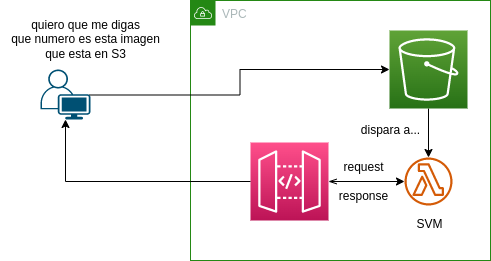

# - AI-serverless

## -- oficial
- Ejemplo completo (_Lambda_, _API Gateway_, _Dynamodb_, _IAM_): [Link](https://docs.aws.amazon.com/lambda/latest/dg/services-apigateway-tutorial.html)
- Ejemplo de despliegue de _lambda_ usando _cloudformation_: [Link](https://docs.aws.amazon.com/AWSCloudFormation/latest/UserGuide/aws-resource-lambda-function.html#aws-resource-lambda-function--examples)
- Reconocimiento de digitos usando SVM: [Link](https://scikit-learn.org/stable/auto_examples/classification/plot_digits_classification.html)
- Ejemplo de como traer una imagen de _S3_ a _Lambda_, modificarlo y luego enviar la nueva imagen nuevamente a _Lambda_: [Link](https://docs.aws.amazon.com/lambda/latest/dg/with-s3-tutorial.html)
- Ejemplo de como descargar una imagen con boto3: [Link](https://boto3.amazonaws.com/v1/documentation/api/1.9.42/guide/s3-example-download-file.html)
- ¿Como usar _TensorFlow_ con _Lambda_? (ver si sirve): [Link](https://aws.amazon.com/es/blogs/machine-learning/using-container-images-to-run-tensorflow-models-in-aws-lambda/)

## -- no oficial
- machine learning using _lambda_: [Link](https://towardsdatascience.com/serverless-deployment-of-machine-learning-models-on-aws-lambda-5bd1ca9b5c42)
- despliegue de _api gateway_ con _lambda_ usando _cloudformation_: [Link](https://bl.ocks.org/magnetikonline/c314952045eee8e8375b82bc7ec68e88)
- 8x8 bits image generator: [Link](https://xantorohara.github.io/led-matrix-editor/)
- Guarda una imagen de manera temporal en _Lambda_: [Link](https://stackoverflow.com/questions/50946378/can-i-store-a-temp-file-on-aws-lambda-function)